# Implementasi Suffix Tree dan DAWG untuk Smart Dictionary (Java)

### Mata Kuliah
Struktur Data dan Pemrograman Berorientasi Objek

### Dosen Pengampu
Hafara Firdausi, S. Kom, M.Kom

---

## Anggota Kelompok

| NRP | Nama |
|---|---|
| 5027251018 | Nazwa Aulia Dwi Purnomo |
| 5027251048 | M. Faris Roisul Azhar |
| 5027251045 | Ahmad Nayottama Juliansyah |
| 5027251008 | Silfi Rochmatul Auliyah |
| 5027251129 | Dafa Ridho Zhafif |

# Daftar Isi

1. Problem Statement / Permasalahan
2. Penjelasan Struktur Tree dan Algoritma
3. Diagram / Visualisasi
4. Aplikasi / Implementasi
5. Keunggulan
6. Kekurangan
7. Perbandingan Tree Dasar dan Modifikasi
8. Analisis Kompleksitas
9. Potensi Pengembangan
10. Hasil Implementasi
11. Perbandingan Performa Real
12. Kesimpulan
13. Referensi

---

## 1. Problem Statement / Permasalahan

#### 1.1 Latar Belakang

Di era digital saat ini, aplikasi kamus modern (modern dictionary) dituntut untuk memberikan respons pencarian yang instan dan interaktif kepada penggunanya. Salah satu fitur esensial yang menjadi standar aplikasi modern adalah autocomplete dan pencarian potongan kata, yang sangat bergantung pada kemampuan komputasi dalam melakukan substring searching. <br>
Seiring dengan bertambah besarnya volume pangkalan data kosa kata, efisiensi pencarian data menggunakan metode sekuensial konvensional (seperti Linear Search) menjadi tidak relevan karena membutuhkan waktu yang berbanding lurus dengan jumlah data (O(N)). <br> Hal ini memicu terjadinya bottleneck atau perlambatan performa aplikasi. Oleh karena itu, diperlukan pendekatan yang lebih mutakhir melalui penggunaan struktur data tingkat lanjut berbasis pohon (tree structure) dan graf automata, seperti Suffix Tree dan DAWG (Directed Acyclic Word Graph). Struktur data ini mampu mereduksi kompleksitas waktu pencarian secara drastis, sehingga pencarian kata murni hanya bergantung pada panjang karakter yang dicari, bukan jumlah kata di dalam kamus.

#### 1.2 Rumusan Masalah

Berdasarkan latar belakang di atas, rumusan masalah dalam proyek ini adalah sebagai berikut:
- Bagaimana cara mengimplementasikan struktur data Suffix Tree murni dari awal untuk pencarian teks?
- Bagaimana cara mengimplementasikan struktur data DAWG (Directed Acyclic Word Graph) sebagai bentuk minimalisasi dari Suffix Tree?
- Bagaimana perbandingan performa antara Linear Search, Suffix Tree, dan DAWG dalam menangani pencarian data (benchmark)?
- Bagaimana penerapan struktur data tingkat lanjut tersebut ke dalam sebuah simulasi aplikasi Smart Dictionary?

#### 1.3 Tujuan

Adapun tujuan yang ingin dicapai melalui pengerjaan proyek ini adalah:
- Memahami secara mendalam landasan teori dan cara kerja struktur data berbasis tree dan automata.
- Mengimplementasikan algoritma Suffix Tree dan DAWG menggunakan bahasa pemrograman Java tanpa menggunakan library eksternal (standalone).
- Menganalisis dan membandingkan performa efisiensi waktu serta memori dari kedua struktur data tersebut melalui pengujian benchmark riil.
- Membuat dan mendemonstrasikan simulasi aplikasi Smart Dictionary yang mampu melakukan pencarian kata dan autocomplete secara cepat dan efisien.

## 2. Penjelasan Struktur Tree dan Algoritma

#### 2.1 Suffix Tree

##### Definisi

Suffix Tree merupakan struktur data berbentuk tree yang digunakan untuk merepresentasikan seluruh suffix dari suatu string dalam bentuk hierarki node. Struktur ini dirancang untuk mempercepat proses pencarian substring dengan memanfaatkan traversal karakter dari root menuju node tertentu.

Menurut Gusfield (1997), suffix tree merupakan salah satu struktur data paling penting dalam bidang string processing karena mampu melakukan substring searching secara efisien dengan kompleksitas linear terhadap panjang pattern. Selain itu, Faro dan Scafiti (2023) menjelaskan bahwa struktur berbasis suffix banyak digunakan pada text indexing, pattern matching, information retrieval, dan Natural Language Processing (NLP).

Pada implementasi program kelompok, Suffix Tree digunakan sebagai dasar pencarian substring pada smart dictionary berbasis Java. Struktur tree dibangun menggunakan class:

public class SuffixTree

Sedangkan node direpresentasikan menggunakan class:

public class TreeNode

Pendekatan ini memungkinkan seluruh substring dari suatu text dapat dicari dengan lebih cepat dibandingkan metode pencarian linear biasa.

##### Struktur Node

Pada implementasi program, setiap node pada Suffix Tree memiliki beberapa komponen utama, yaitu:

| Komponen | Fungsi |
|---|---|
| character | Menyimpan karakter node |
| children | Menyimpan child node |
| isEnd | Menandai akhir suffix |

Implementasi struktur node:

char character;
HashMap<Character, TreeNode> children;
boolean isEnd;

Keterangan:

1. character digunakan untuk menyimpan karakter pada node.
2. children digunakan untuk menyimpan child node menggunakan struktur HashMap.
3. isEnd digunakan sebagai penanda akhir suffix.

Penggunaan HashMap<Character, TreeNode> memungkinkan proses pencarian child node dilakukan lebih cepat dibandingkan traversal linear pada array biasa.

Pada implementasi program:

this.children = new HashMap<>();

setiap node dapat memiliki banyak child node sesuai karakter yang tersedia pada text.

Traversal dilakukan dengan berpindah dari parent node menuju child node berdasarkan karakter input. Struktur ini membentuk jalur traversal yang merepresentasikan substring tertentu.

##### Cara Kerja

Suffix Tree bekerja dengan memasukkan seluruh suffix dari suatu string ke dalam tree. Sebagai contoh, apabila diberikan string: <br>
```
teknologi
```
maka suffix yang dihasilkan:
```
teknologi
eknologi
knologi
nologi
ologi
logi
ogi
gi
i
```
Seluruh suffix tersebut akan dimasukkan ke dalam tree sehingga substring dapat dicari menggunakan traversal karakter.

Pada implementasi program, proses build tree dilakukan menggunakan method:
```java
public void buildTree(String text)
```
dengan proses pembentukan suffix:
```java
String suffix = text.substring(i);
```
Setelah suffix diperoleh, program akan memasukkannya ke dalam tree menggunakan:
```java
insertSuffix(suffix);
```
Pada program utama (Main.java), tree dibangun menggunakan:
```java
SuffixTree tree = new SuffixTree();
tree.buildTree(text);
```
Text yang digunakan pada implementasi program adalah:
```text
String text = "teknologi informasi information technology cyber security internet of things integration system smart city";
```
Dengan demikian, seluruh substring dari text tersebut dapat dikenali oleh Suffix Tree.

##### Algoritma Insertion
Proses insertion dilakukan dengan memasukkan karakter dari setiap suffix satu per satu ke dalam tree. Pendekatan ini memungkinkan seluruh suffix string tersimpan secara eksplisit sehingga substring dapat dicari melalui traversal karakter.

Pada implementasi program, insertion dilakukan menggunakan method:
```java
public void insertSuffix(String suffix)
```
Traversal karakter dilakukan menggunakan perulangan:
```java
for (int i = 0; i < suffix.length(); i++)
```
Setiap karakter diambil menggunakan:
```java
char ch = suffix.charAt(i);
```
Kemudian program memeriksa apakah child node dengan karakter tersebut sudah tersedia:
```java
if (!current.children.containsKey(ch))
```
Apabila child node belum tersedia, maka program akan membuat node baru menggunakan:
```java
current.children.put(ch, new TreeNode(ch));
```
Setelah node ditemukan atau berhasil dibuat, traversal akan berpindah ke child node berikutnya menggunakan:
```java
current = current.children.get(ch);
```
Setelah seluruh karakter pada suffix berhasil dimasukkan ke dalam tree, node terakhir akan ditandai sebagai akhir suffix menggunakan:
```java
current.isEnd = true;
```
Pendekatan insertion tersebut memungkinkan seluruh suffix tersimpan secara sistematis dalam struktur tree sehingga proses substring searching dapat dilakukan dengan lebih efisien dibandingkan pencarian linear biasa.

Menurut Gusfield (1997), penyimpanan seluruh suffix dalam struktur tree memungkinkan proses traversal substring dilakukan secara cepat karena pencarian cukup mengikuti jalur karakter yang sesuai pada tree.

##### Search Substring
Pencarian substring dilakukan menggunakan traversal karakter dari root menuju child node berdasarkan pattern yang dicari.

Pada implementasi program, proses search dilakukan menggunakan method:
```java
public boolean search(String pattern)
```
Traversal dilakukan menggunakan:
```java
char ch = pattern.charAt(i);
```
Kemudian program memeriksa keberadaan child node:
```java
if (!current.children.containsKey(ch)) {
    return false;
}
```
Apabila seluruh karakter berhasil ditelusuri, maka substring dianggap ditemukan.

Pada program utama (Main.java), substring yang ditemukan akan ditampilkan bersama kata yang mengandung substring tersebut:
```java
if (word.contains(pattern)) {
    System.out.println("- " + word);
}
```
Sebagai contoh:
```
Input  : log
Output :
- teknologi
```

##### Kompleksitas

| Operasi    | Kompleksitas |
| ---------- | ------------ |
| Build Tree | O(n²)        |
| Search     | O(m)         |

Keterangan:

- `n` merupakan panjang text.
- `m` merupakan panjang pattern.

Kompleksitas build tree bersifat O(n²) karena seluruh suffix string dimasukkan satu per satu ke dalam tree. Sedangkan proses pencarian substring memiliki kompleksitas O(m) karena traversal hanya dilakukan sepanjang pattern.

Menurut Gusfield (1997), suffix tree memungkinkan substring searching dilakukan secara efisien dibandingkan metode pencarian linear biasa.

#### 2.2 DAWG (Directed Acyclic Word Graph)
##### Definisi

Directed Acyclic Word Graph (DAWG) merupakan struktur graph berbasis automata yang digunakan untuk mengenali substring suatu string secara efisien. Struktur ini diperoleh melalui proses minimisasi state sehingga penggunaan memori menjadi lebih hemat dibanding suffix trie biasa.

Menurut Fujishige dkk. (2023), DAWG merupakan minimal automata yang mampu merepresentasikan substring dengan kompleksitas ruang linear.

Pada implementasi program ini, DAWG dibangun menggunakan pendekatan suffix automaton melalui class:
```java
public class DAWG
```
dengan state direpresentasikan menggunakan:
```java
public class State
```
##### Konsep Automata

DAWG terdiri atas beberapa komponen utama:

| Komponen | Fungsi |
|---|---|
| State | Merepresentasikan substring |
| Transition | Perpindahan antar state |
| Suffix Link | Relasi antar substring |
| Clone State | State hasil minimization |

State pada implementasi program memiliki atribut sebagai berikut:
```java
public int len;
public int link;
public int[] next;
public boolean isClone;
```
Keterangan atribut:
1. len digunakan untuk menyimpan panjang substring maksimum yang direpresentasikan state.
2. link merupakan suffix link menuju state sebelumnya.
3. next digunakan untuk menyimpan transition antar state.
3. isClone digunakan sebagai penanda clone state hasil proses minimization.

##### State Minimization
Salah satu keunggulan utama DAWG adalah proses minimisasi state. State yang memiliki transition identik dapat digabung sehingga penggunaan memori menjadi lebih efisien dibandingkan suffix trie biasa.

Pada implementasi program, clone state dibuat menggunakan kode berikut:
```java
int clone = newState(pool[p].len + 1, pool[q].link);
pool[clone].copyTransitionsFrom(pool[q]);
pool[clone].isClone = true;
```

##### Hubungan dengan Suffix Tree

Perbedaan utama antara Suffix Tree dan DAWG dapat dilihat pada tabel berikut:

| Aspek | Suffix Tree | DAWG |
|---|---|---|
| Struktur | Tree | Directed Graph |
| Penyimpanan | Banyak node | Lebih hemat |
| Traversal | Sederhana | Lebih kompleks |
| Memori | Besar | Efisien |

Suffix Tree melakukan penyimpanan seluruh suffix secara eksplisit dalam bentuk tree. Sebaliknya, DAWG menggunakan minimisasi state untuk mengurangi redundansi sehingga penggunaan memori menjadi lebih hemat.

##### Search Recognition

Pencarian substring pada DAWG dilakukan menggunakan traversal transition antar state melalui method:
```java
public boolean contains(String pattern)
```
Traversal dilakukan menggunakan:
```java
int nxt = pool[cur].get(pattern.charAt(i));
```
Apabila transition tidak ditemukan:
```java
if (nxt == -1) return false;
```
maka substring dianggap tidak terdapat pada automata.

##### Kompleksitas

| Operasi | Kompleksitas |
|---|---|
| Build | O(n) – O(n log n) |
| Search | O(m) |

## 3. Diagram / Visualisasi

Bab ini membahas visualisasi dua struktur data utama yang diimplementasikan dalam program, yaitu Suffix Tree dan Directed Acyclic Word Graph (DAWG). Kedua struktur digunakan untuk operasi pencarian substring secara efisien.

### 3.1 Diagram Suffix Tree
Suffix Tree diimplementasikan dalam SuffixTree.java dan TreeNode.java. Setiap node menyimpan satu karakter, dan setiap suffix dari string input dimasukkan dari root dengan memanggil insertSuffix(). Pencarian dilakukan dengan menelusuri karakter demi karakter dari root.
Suffix yang dibentuk:

| No | Suffix |
|----|---------|
| 1 | teknologi |
| 2 | eknologi |
| 3 | knologi |
| 4 | nologi |
| 5 | ologi |
| 6 | logi |
| 7 | ogi |
| 8 | gi |
| 9 | i |

#### 3.1. A Visualisasi Suffix Tree

Berikut adalah pohon suffix yang dibangun dari string "teknologi" melalui buildTree(). Setiap baris menunjukkan satu node dalam tree, dimulai dari ROOT.

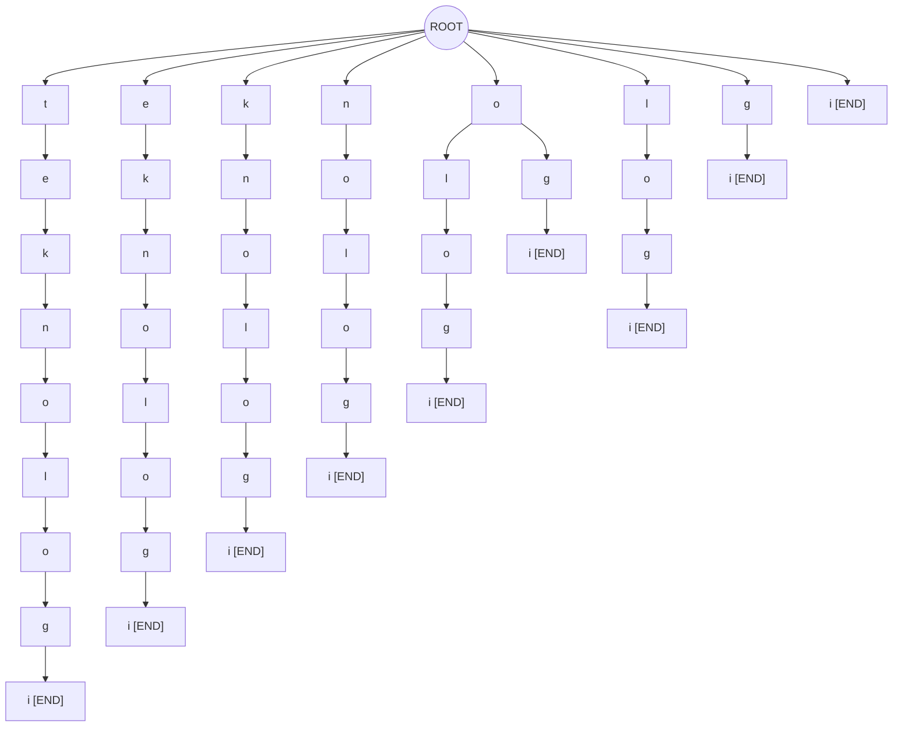

—

#### 3.1. B Output Traversal
Tabel berikut menampilkan hasil pencarian berbagai pola substring menggunakan metode search() pada Suffix Tree yang telah dibangun dari string "teknologi".
 
Prinsip kerja search(): karakter pattern ditelusuri satu per satu dari root. Jika semua karakter ditemukan dalam path dari root, maka substring dianggap ada. Kompleksitas waktu: O(m) di mana m adalah panjang pattern.


| Pattern | Hasil Search | Keterangan |
|----------|--------------|-------------|
| `tekno` |  FOUND | `"tekno"` ditemukan sebagai substring dalam `"teknologi"` |
| `nologi` |  FOUND | `"nologi"` ditemukan sebagai substring dalam `"teknologi"` |
| `ogi` |  FOUND | `"ogi"` ditemukan sebagai substring dalam `"teknologi"` |
| `olo` |  FOUND | `"olo"` ditemukan sebagai substring dalam `"teknologi"` |
| `xyz` |  NOT FOUND | `"xyz"` tidak ada pada suffix tree |
| `log` |  FOUND | `"log"` ditemukan sebagai substring dalam `"teknologi"` |
| `tek` |  FOUND | `"tek"` ditemukan sebagai substring dalam `"teknologi"` |
| `gi` |  FOUND | `"gi"` ditemukan sebagai substring dalam `"teknologi"` |


---


### 3.2 DAWG (Directed Acyclic Word Graph)
DAWG diimplementasikan dalam DAWG.java dan State.java menggunakan algoritma konstruksi online (suffix automaton). Tidak seperti Suffix Tree, DAWG tidak menyimpan seluruh suffix secara eksplisit, melainkan membangun automata terdeterministik yang menerima semua substring dari string input.

Setiap state menyimpan: panjang suffix terpanjang (len), suffix link (link), array transisi (next[128]), dan flag isClone. State dibangun secara incremental setiap karakter dimasukkan melalui metode extend(char c).

#### 3.2.A State Transition


Tabel berikut menampilkan semua state yang terbentuk setelah DAWG dibangun dari string "tekno" melalui pemanggilan dawg.build("tekno").

String input : "tekno"
Jumlah state : 6 state (q0 – q5)
Jumlah transisi : 5 transisi (t, e, k, n, o)
| State | Len | Suffix Link | Clone? | Transisi | Keterangan |
|------|------|--------------|---------|-----------|-------------|
| q0 | 0 | – | Tidak | t → q1 | Initial state (q0) |
| q1 | 1 | q0 | Tidak | e → q2 | State setelah 't' |
| q2 | 2 | q0 | Tidak | k → q3 | State setelah 'te' |
| q3 | 3 | q0 | Tidak | n → q4 | State setelah 'tek' |
| q4 | 4 | q0 | Tidak | o → q5 | State setelah 'tekn' |
| q5 | 5 | q0 | Tidak | — (terminal) | Accept state — 'tekno' |


- **State**: label state automata (`q0` = initial, `q5` = accept/last)
- **Len**: panjang substring terpanjang yang diakhiri oleh state ini
- **Suffix Link**: pointer ke state lain (digunakan saat clone terjadi)
- **Clone**: menandai bahwa state ini dibuat sebagai duplikat saat resolve konflik
- **Transisi**: karakter dan state tujuan yang dapat dicapai dari state ini


#### 3.2. B Graph Automata

Graph automata berikut menggambarkan secara visual alur transisi antar state DAWG. Panah horizontal adalah transisi karakter, sedangkan panah putus-putus ke bawah adalah suffix link.

String input: "tekno" menghasilkan jalur linear karena setiap karakter unik, sehingga tidak terjadi clone state. Pada string yang lebih kompleks (karakter berulang), DAWG akan memiliki state yang berbagi suffix link dan clone state akan muncul.

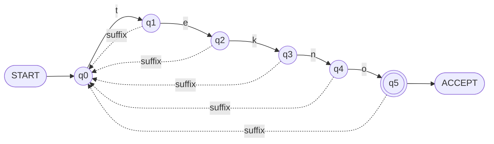

---


Penjelasan Elemen Graph

- `(q0)` : State awal / initial state — seluruh pencarian dimulai dari sini
- `((q5))` : Accept state — state akhir yang menandakan string diterima
- `──c──>` : Transisi karakter dari satu state ke state lain
- `<──` : Suffix link dari state qN kembali menuju `q0`
- Setiap state merepresentasikan substring tertentu dari string input
- DAWG menyimpan substring secara efisien tanpa menduplikasi node seperti pada trie biasa

Gambar 3.2 — Trace Pencarian pada DAWG

Trace search("tekno")

```text
q0 ──"t"──> q1
q1 ──"e"──> q2
q2 ──"k"──> q3
q3 ──"n"──> q4
q4 ──"o"──> q5 [ACCEPT]

=> Result: FOUND ✓
```

---

Trace search("ekn")

```text
q0 ──"e"──> [TIDAK ADA TRANSISI]

=> Result: NOT FOUND ✗
   (DAWG hanya menerima string dari posisi awal)
```

---

Trace search("tek")

```text
q0 ──"t"──> q1
q1 ──"e"──> q2
q2 ──"k"──> q3

=> Result: FOUND ✓ (prefix diterima)
```

---

Penjelasan Metode contains(pattern)

Metode `contains(pattern)` pada `DAWG.java` bekerja dengan menelusuri karakter pattern dari state awal `q0`.

Proses pencarian dilakukan sebagai berikut:

1. Membaca karakter pattern satu per satu
2. Mengecek transisi karakter pada state saat ini
3. Jika transisi tersedia → pindah ke state berikutnya
4. Jika tidak ada transisi → pencarian langsung gagal (`false`)
5. Jika seluruh karakter berhasil ditelusuri → mengembalikan `true`

---

Analisis Hasil Pencarian

| Pattern | Hasil | Keterangan |
|----------|--------|-------------|
| `"tekno"` | FOUND ✓ | Seluruh transisi tersedia hingga accept state |
| `"ekn"` | NOT FOUND ✗ | Tidak ada transisi `'e'` dari `q0` |
| `"tek"` | FOUND ✓ | Prefix valid berhasil ditelusuri |

---

Kompleksitas Waktu

Kompleksitas pencarian substring pada DAWG bersifat linear terhadap panjang pattern:

```text
O(m)
```

dengan:

- `m` = jumlah karakter pattern yang dicari


Diagram Alur Program

Diagram berikut menunjukkan alur utama program pencarian substring menggunakan struktur data **Suffix Tree** dan **DAWG**.

---

Diagram Alur Umum

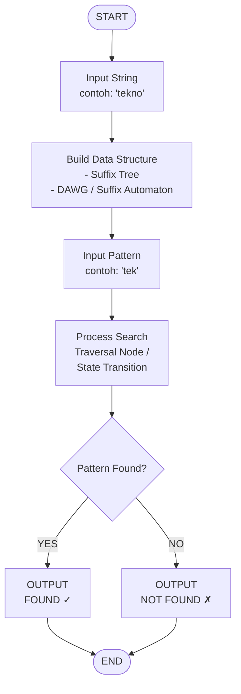

---

Penjelasan Alur Program

1. Input String

Program menerima string utama dari pengguna.

Contoh:

```text
"tekno"
```

String ini akan digunakan untuk membangun struktur data pencarian.

---

2. Build Data Structure

Program membangun:

a. Suffix Tree

- Seluruh suffix string dimasukkan ke dalam tree
- Setiap node merepresentasikan karakter
- Digunakan untuk pencarian substring berbasis traversal node

b. DAWG (Directed Acyclic Word Graph)

- Dibangun menggunakan algoritma suffix automaton
- Menyimpan transisi state secara efisien
- Digunakan untuk pencarian berbasis automata

---

3. Input Pattern

Pengguna memasukkan substring/pattern yang ingin dicari.

Contoh:

```text
"tek"
```

---

4. Process Search

Program melakukan pencarian:

Pada Suffix Tree

- Traversal karakter dari root
- Jika seluruh karakter ditemukan → sukses

Pada DAWG

- Mengikuti transisi state
- Jika transisi gagal → pencarian dihentikan

---

5. Hasil Pencarian

Program menampilkan hasil:

| Kondisi | Output |
|----------|---------|
| Pattern ditemukan | `FOUND ✓` |
| Pattern tidak ditemukan | `NOT FOUND ✗` |

---

Kompleksitas Pencarian

Baik Suffix Tree maupun DAWG memiliki kompleksitas pencarian:

```text
O(m)
```

dengan:

- `m` = panjang pattern yang dicari 


## 4. Aplikasi / Implementasi

#### Deskripsi Program
Program ini merupakan aplikasi smart dictionary sederhana berbasis Java yang digunakan untuk melakukan pencarian istilah dalam bidang teknologi informasi. Program menyediakan beberapa fitur pencarian, yaitu pencarian kata secara tepat (exact search), pencarian berdasarkan awalan kata (autocomplete), dan pencarian berdasarkan substring.

Data kata disimpan dalam bentuk array yang berisi beberapa istilah teknologi informasi, seperti “cyber security”, “internet of things”, dan “smart city”. Pengguna dapat memilih menu yang tersedia melalui terminal, kemudian memasukkan kata kunci yang ingin dicari. Sistem akan memproses input pengguna dan menampilkan hasil yang sesuai berdasarkan jenis pencarian yang dipilih.

Dalam implementasinya, program memanfaatkan method bawaan Java seperti `equals()` untuk pencarian kata secara tepat, `startsWith()` untuk fitur autocomplete, dan `contains()` untuk pencarian substring. Program juga dilengkapi dengan penanganan kondisi apabila kata yang dicari tidak ditemukan.


#### Bahasa Pemrograman
Java

#### Struktur File

| File               | Fungsi                    |
| ------------------ | ------------------------- |
| TreeNode.java      | Struktur node suffix tree |
| SuffixTree.java    | Implementasi suffix tree  |
| State.java         | Struktur state DAWG       |
| DAWG.java          | Implementasi DAWG         |
| DictionaryApp.java | Fitur dictionary          |
| Benchmark.java     | Benchmark                 |
| Visualizer.java    | Visualisasi               |
| Main.java          | Integrasi                 |

#### Fitur Program
- searchWord() <br>
    Mencari kata atau frasa yang sama persis dengan input pengguna. 
- substringSearch() <br>
	Mencari kata yang mengandung bagian teks tertentu. 
- autocomplete() <br>
	Menampilkan daftar kata yang memiliki awalan sesuai input pengguna. 
- suggested word <br>
	Memberikan rekomendasi kata berdasarkan hasil autocomplete atau substring yang cocok dengan input pengguna.

#### Alur Program

Mulai<br>
↓<br>
Tampilkan Menu:
1. Search Word
2. Autocomplete
3. Substring Search<br>
↓<br>
Pengguna Memilih Menu<br>
↓<br>
Input Kata Kunci<br>
↓<br>
Sistem Melakukan Pencarian<br>
↓<br>
Kata Ditemukan?<br>
├── Ya → Tampilkan Hasil<br>
└── Tidak → Tampilkan "Kata tidak ditemukan"<br>
↓<br>
Selesai 

## 5. Keunggulan

### 5.1 Keunggulan Suffix Tree

#### Keunggulan Suffix Tree Secara Umum

Suffix Tree adalah struktur data berbentuk pohon yang menyimpan semua suffix dari sebuah string. Secara umum, Suffix Tree memiliki keunggulan sebagai berikut:

- **Search cepat** — Pencarian substring dapat dilakukan dalam waktu O(m) di mana m adalah panjang pattern, terlepas dari panjang teks yang disimpan.
- **Traversal sederhana** — Struktur pohon memudahkan traversal dan navigasi antar node secara hierarkis dan intuitif.
- **Substring searching efisien** — Karena semua suffix teks tersimpan dalam pohon, pencarian substring manapun cukup dilakukan dengan menelusuri cabang pohon dari root.

#### Keunggulan Suffix Tree Pada Code Yang Diimplementasikan

Implementasi Suffix Tree pada project ini terdapat pada file `SuffixTree.java` dan `TreeNode.java`. Berikut keunggulan konkret yang tercermin dalam code:

#### Search Cepat — O(m) per Pencarian

Metode `search()` pada `SuffixTree.java` hanya perlu menelusuri karakter per karakter dari root, tanpa perlu membandingkan seluruh dataset:

```java
public boolean search(String pattern) {
    TreeNode current = root;
    for (int i = 0; i < pattern.length(); i++) {
        char ch = pattern.charAt(i);
        if (!current.children.containsKey(ch)) {
            return false;  
        }
        current = current.children.get(ch);
    }
    return true;
}
```

Pencarian hanya bergantung pada panjang `pattern` (m), bukan pada ukuran teks keseluruhan — jauh lebih efisien dibandingkan linear search O(n·m).

---

#### Traversal Sederhana — Struktur HashMap per Node

`TreeNode.java` menggunakan `HashMap<Character, TreeNode>` sebagai struktur children, sehingga traversal antar node menjadi langsung dan natural:

```java
public class TreeNode {
    char character;
    HashMap<Character, TreeNode> children;
    boolean isEnd;

    public TreeNode(char character) {
        this.character = character;
        this.children = new HashMap<>();
        this.isEnd = false;
    }
}
```

Dengan HashMap, akses ke child node tertentu adalah O(1), membuat traversal pohon menjadi sangat sederhana dan tidak memerlukan iterasi linear.

---

#### Substring Searching Efisien karena Semua Suffix Tersimpan

Metode `buildTree()` menyisipkan **setiap suffix** dari teks ke dalam pohon, sehingga semua kemungkinan substring dapat ditemukan hanya dengan satu kali traversal dari root:

```java
public void buildTree(String text) {
    for (int i = 0; i < text.length(); i++) {
        String suffix = text.substring(i);
        insertSuffix(suffix);  
    }
}
```

Sebagai contoh, jika teks adalah `"teknologi"`, maka suffix yang disimpan meliputi `"teknologi"`, `"eknologi"`, `"knologi"`, ..., `"i"`. Pencarian substring `"nologi"` pun langsung berhasil tanpa harus memindai seluruh teks.

---

Implementasi ini juga dimanfaatkan di `Main.java` untuk mencari substring dalam kalimat panjang yang berisi beberapa frasa sekaligus:

```java
String text = "teknologi informasi information technology cyber security " +
              "internet of things integration system smart city";
SuffixTree tree = new SuffixTree();
tree.buildTree(text);
// ...
boolean found = tree.search(pattern);
```

---

### 5.2 Keunggulan DAWG

#### Keunggulan DAWG Secara Umum

DAWG (Directed Acyclic Word Graph) adalah struktur data yang merupakan hasil minimisasi dari Suffix Automaton. Secara umum, DAWG memiliki keunggulan sebagai berikut:

- **Hemat memori** — State-state yang memiliki suffix link yang sama digabungkan (di-clone), sehingga jumlah total state jauh lebih sedikit dibandingkan Suffix Tree biasa.
- **State lebih sedikit** — Jumlah state dijamin tidak melebihi 2n − 1 dan jumlah transisi tidak melebihi 3n − 4, di mana n adalah panjang string input.
- **Minimization** — DAWG secara otomatis melakukan minimisasi selama proses pembangunan melalui mekanisme suffix link dan clone, menghasilkan struktur paling kompak untuk merepresentasikan seluruh substring.

#### Keunggulan DAWG pada Code yang diimplementasikan

Implementasi DAWG pada project ini terdapat pada file `DAWG.java` dan `State.java`. Berikut keunggulan konkret yang tercermin dalam code:

#### Hemat Memori (Pool-based Allocation)

`DAWG.java` tidak menggunakan alokasi objek individual per state, melainkan menggunakan array `pool` yang dapat tumbuh dinamis (doubling strategy):

```java
private int newState(int len, int link) {
    if (size == pool.length) {
        State[] grown = new State[pool.length * 2];  // doubling
        for (int i = 0; i < pool.length; i++) grown[i] = pool[i];
        pool = grown;
    }
    pool[size] = new State(len, link);
    return size++;
}
```

Pendekatan ini menghemat overhead alokasi memori yang berulang dan memastikan state tersimpan secara contigous di memori.

---

#### State Lebih Sedikit — Batas Teoritis Terjamin

`printStates()` dalam `DAWG.java` secara eksplisit memverifikasi bahwa jumlah state dan transisi tidak melampaui batas teoritis DAWG:

```java
printfLn("  Total state      : %d  (batas teoritis <= %d)",
         size, 2 * pool[last].len - 1);
printfLn("  Total transisi   : %d  (batas teoritis <= %d)",
         countTransitions(), 3 * pool[last].len - 4);
```

---

#### Minimization — Clone Mechanism via Suffix Link

Proses minimisasi terjadi secara otomatis dalam metode `extend()` melalui mekanisme **clone** ketika ditemukan state yang perlu dipecah untuk menjaga konsistensi suffix link:

```java
int clone = newState(pool[p].len + 1, pool[q].link);
pool[clone].copyTransitionsFrom(pool[q]);
pool[clone].isClone = true;  

while (p != -1 && pool[p].get(c) == q) {
    pool[p].put(c, clone);  
    p = pool[p].link;
}
pool[q].link   = clone;
pool[cur].link = clone;
```

State yang di-clone menyalin semua transisi dari state asalnya, dan seluruh pointer yang sebelumnya menuju state asal di-redirect ke clone — inilah inti dari proses minimization DAWG.

---

#### Perbandingan Ringkas

| Aspek | Suffix Tree | DAWG |
|---|---|---|
| Kecepatan Search | O(m) | O(m) |
| Penggunaan Memori | Lebih besar | Lebih hemat |
| Jumlah State | O(n²) worst case | ≤ 2n − 1 |
| Kompleksitas Build | O(n) | O(n) |
| Struktur Node | HashMap per node | Array transisi flat |
| Minimization | Tidak | Ya (otomatis) |

---

*Implementasi lengkap tersedia di: `SuffixTree.java`, `TreeNode.java`, `DAWG.java`, `State.java`* 


## 6. Kekurangan

Meskipun menawarkan performa pencarian yang sangat cepat, penggunaan struktur data tingkat lanjut pada Smart Dictionary ini juga memiliki kelemahan yang perlu dipertimbangkan, antara lain:

#### 6.1 Kekurangan Suffix Tree
- Jumlah Node yang Masif (Node Banyak): Struktur dasar Suffix Tree memetakan setiap kemungkinan sufiks menjadi cabang-cabang node tersendiri. Karena tidak ada mekanisme penggabungan (merging) untuk jalur karakter yang berulang (duplikat), jumlah node akan membengkak secara drastis seiring dengan bertambahnya jumlah kata dalam kamus.
- Konsumsi Memori yang Sangat Besar: Akibat dari banyaknya node yang tercipta, Suffix Tree sangat boros memori. Pada implementasi proyek ini (di mana setiap TreeNode menggunakan HashMap untuk menyimpan referensi anak-anaknya), overhead memori yang dibutuhkan untuk meload keseluruhan kamus akan sangat tinggi, sehingga kurang ideal untuk perangkat dengan kapasitas RAM terbatas.
- Proses Build yang Cukup Kompleks: Walaupun kecepatan pencariannya sangat instan, proses pembangunan awal (construction phase) dari Suffix Tree membutuhkan komputasi yang rumit. Algoritma harus memotong setiap kata menjadi substring lalu mengaitkannya ke hierarki node yang tepat secara berulang-ulang saat program pertama kali dijalankan.

#### 6.2 Kekurangan DAWG
- Tingkat Kesulitan Implementasi yang Tinggi (Implementasi Sulit): Berbeda dengan pohon (tree) standar yang alurnya selalu bercabang ke bawah, DAWG (sebagai graf) mengharuskan penggabungan kembali cabang-cabang yang memiliki akhiran kata sama. Menulis kodingan untuk mengatur ulang suffix link, mendeteksi clone, dan memastikan tidak ada putaran (siklus) di dalam graf sangatlah rumit, rawan bug, dan sulit untuk di-debug.
- Struktur Automata yang Lebih Kompleks: DAWG pada dasarnya beroperasi murni sebagai mesin state DFA (Deterministic Finite Automaton). Karena jalurnya bisa menyatu kembali (converge), melacak alur data atau memvisualisasikan bagaimana sebuah kata disimpan di dalam DAWG secara manual (di atas kertas) jauh lebih membingungkan dibandingkan dengan Suffix Tree yang bentuknya hierarkis. Pemahaman teori graf dan automata sangat diwajibkan di sini.


## 7. Perbandingan Tree Dasar dan Modifikasi Secara Teori

| Aspek | Suffix Tree | DAWG |
|---|---|---|
| Struktur | Tree | Automata |
| Memori | Besar | Lebih hemat |
| Search | Cepat | Cepat |
| Kompleksitas | Sedang | Tinggi |

### Analisis Teori

Suffix Tree dan DAWG sama-sama digunakan untuk melakukan substring searching secara efisien, namun keduanya memiliki pendekatan struktur data yang berbeda.

Suffix Tree menggunakan struktur tree yang menyimpan seluruh suffix string secara eksplisit. Pada implementasi program, struktur ini direpresentasikan menggunakan class:

```java id="u3f8lz"
public class SuffixTree
```

dengan node yang disimpan melalui:

```java
HashMap<Character, TreeNode> children;
```

Pendekatan tersebut membuat traversal menjadi lebih sederhana karena pencarian dilakukan langsung dari root menuju child node berdasarkan karakter input.

Sebaliknya, DAWG menggunakan pendekatan automata berbentuk directed acyclic graph. Pada implementasi program, struktur ini direpresentasikan menggunakan:
```java
public class DAWG
```
dengan state automata yang disimpan pada class:
```java
public class State
```
DAWG memiliki efisiensi memori yang lebih baik karena menggunakan minimisasi state. State dengan transition identik dapat digabung sehingga redundansi substring dapat dikurangi. Pada implementasi program, proses minimisasi dilakukan melalui clone state menggunakan kode berikut:
```java
int clone = newState(pool[p].len + 1, pool[q].link);
pool[clone].copyTransitionsFrom(pool[q]);
pool[clone].isClone = true;
```
Menurut Fujishige dkk. (2023), jumlah maksimum state pada DAWG hanya sebesar:
```
2n - 1
```
dengan jumlah maksimum edge sebesar:
```
3n - 4
```
Hal tersebut menunjukkan bahwa DAWG memiliki penggunaan memori yang lebih efisien dibandingkan suffix trie maupun suffix tree biasa.

Dari sisi traversal, Suffix Tree memiliki proses traversal yang lebih sederhana karena hanya memerlukan perpindahan node berdasarkan child character. Pada implementasi program, traversal dilakukan menggunakan:
```java
current = current.children.get(ch);
```
Sedangkan pada DAWG, traversal dilakukan melalui transition antar state menggunakan:
```java
int nxt = pool[cur].get(pattern.charAt(i));
```
Pendekatan automata pada DAWG membuat implementasinya lebih kompleks karena memerlukan suffix link dan clone state, namun memberikan efisiensi ruang yang lebih baik.

Berdasarkan penelitian Faro dan Scafiti (2023), struktur berbasis suffix automata sangat efektif dalam proses string matching modern karena mampu mempertahankan kompleksitas pencarian linear terhadap panjang pattern.

## 8. Analisis Kompleksitas Berdasarkan Struktur Tree
Struktur data Suffix Tree dan DAWG (Directed Acyclic Word Graph) merupakan fondasi utama dari performa pencarian dalam Smart Dictionary. Bagian ini akan membedah kompleksitas algoritma dari kedua struktur tersebut untuk memahami bagaimana program mampu memproses ribuan kata secara efisien.

#### 8.1 Kompleksitas Suffix Tree

Suffix Tree menyimpan seluruh kemungkinan sufiks (akhiran) dari sekumpulan string di dalam bentuk pohon trie yang terkompresi.

- Insertion (Penyisipan): Jika dibangun menggunakan pendekatan naif, kompleksitas waktu penyisipan teks dengan panjang n adalah O(n2). Namun, pada implementasi praktis standar (seperti algoritma Ukkonen), penyisipan seluruh karakter dapat diselesaikan dalam waktu linear O(n).
- Traversal (Penelusuran): Menelusuri seluruh node dalam Suffix Tree (misalnya untuk mencetak semua kata yang memiliki awalan tertentu pada fitur Autocomplete) membutuhkan waktu yang sebanding dengan jumlah node yang dikunjungi, yaitu O(m+k), di mana m adalah panjang awalan/kata dan k adalah jumlah kemunculan hasil yang ditemukan.
- Search (Pencarian Substring): Ini adalah keunggulan utama dari Suffix Tree. Untuk mencari apakah sebuah substring ada di dalam teks, algoritma hanya perlu mengikuti cabang (edge) dari root ke bawah. Kompleksitas waktunya adalah O(m), murni bergantung pada panjang karakter yang dicari (m), tanpa memedulikan seberapa besar data di dalam kamus secara keseluruhan.

#### 8.2 Kompleksitas DAWG
DAWG adalah bentuk minimalisasi dari Suffix Tree yang mengubah struktur pohon menjadi Directed Acyclic Graph (graf berarah tak bersiklus) layaknya sebuah mesin state DFA (Deterministic Finite Automaton).

- State Transition (Transisi State): Proses berpindah dari satu state ke state berikutnya saat membaca suatu karakter memiliki kompleksitas konstan O(1) (karena transisi diimplementasikan menggunakan pemetaan array berukuran 128 untuk karakter ASCII).
- Minimization (Minimalisasi Ruang): DAWG secara otomatis melebur (merging) state-state yang memiliki sufiks atau jalur ekuivalen. Algoritma pembentukan DAWG secara linear (online algorithm dari Blumer dkk.) menjamin bahwa jumlah total state maksimal adalah 2n−1 dan jumlah transisinya maksimal 3n−4. Pembentukannya memakan waktu linear O(n).
- Substring Recognition (Pengenalan Substring): Karena DAWG bertindak sebagai mesin automata pengenal string, mengecek keberadaan substring hanya dilakukan dengan melakukan transisi state per karakter. Kompleksitas waktunya sangat optimal, yaitu O(m), di mana m adalah panjang kata kunci yang dicari.

#### 8.3 Analisis Efisiensi
Perbandingan efisiensi keseluruhan antara Suffix Tree dan DAWG dalam proyek Smart Dictionary ini dapat disimpulkan sebagai berikut:

- Search Complexity: Keduanya menawarkan tingkat efisiensi pencarian tingkat dewa sebesar O(m). Hal ini jauh melampaui kemampuan Linear Search konvensional yang membutuhkan waktu O(N×m), menjadikannya sangat ideal untuk pencarian kamus skala besar.
- Memory Complexity: Keduanya memiliki kompleksitas ruang memori secara teoretis sebesar O(n). Namun, pada implementasi nyatanya, Suffix Tree sangat boros memori (memiliki faktor konstanta memori yang besar akibat duplikasi node pada cabang yang mirip). Sebaliknya, DAWG jauh lebih hemat dan efisien karena struktur DAG-nya mendaur ulang cabang atau sufiks yang memiliki kesamaan (efek dari state minimization).
- Traversal Efficiency: Untuk menelusuri data dalam rangka ekstraksi kata (autocomplete), Suffix Tree sedikit lebih terstruktur karena bentuknya yang hierarkis murni (dari atas ke bawah). Sementara pada DAWG, penelusurannya juga sangat cepat (O(1) per karakter) namun alurnya membentuk graf yang padat, sehingga sangat unggul dalam melakukan validasi eksistensi (apakah kata tersebut ada atau tidak).

## 9. Potensi Pengembangan ke Depan

---

Struktur data Suffix Tree dan DAWG yang telah diimplementasikan dalam project ini memiliki potensi besar untuk dikembangkan lebih lanjut ke berbagai aplikasi nyata. Berikut adalah potensi pengembangan yang dapat dilakukan:

---

### 9.1 Spell Checker

#### Definisi Umum

Spell checker adalah sistem yang mendeteksi dan mengoreksi kesalahan ejaan dalam teks. Sistem ini membutuhkan kemampuan mencocokkan kata yang salah eja dengan kata yang paling mendekati dalam kamus.

#### Potensi pada Implementasi

DAWG sangat cocok dijadikan fondasi spell checker karena kemampuannya menyimpan seluruh kata dalam kamus secara kompak. Pengembangan yang dapat dilakukan:

- Menambahkan **Edit Distance (Levenshtein)** pada proses traversal DAWG untuk menemukan kata dengan perbedaan karakter minimal.
- Memanfaatkan `contains()` di `DAWG.java` sebagai pengecekan awal apakah kata sudah benar sebelum masuk ke proses koreksi.
- Mengintegrasikan kamus kata baku bahasa Indonesia ke dalam `DictionaryApp.java` sehingga sistem dapat menyarankan koreksi secara otomatis.

```java
if (!dawg.contains(inputWord)) {
    System.out.println("Kata tidak ditemukan. Mungkin maksud Anda: ");
}
```

---

### 9.2 Recommendation System

#### Definisi Umum

Recommendation system adalah sistem yang menyarankan konten, produk, atau kata berdasarkan pola input pengguna. Dalam konteks teks, sistem ini dapat merekomendasikan kata atau frasa berikutnya berdasarkan histori pencarian.

#### Potensi pada Implementasi

Suffix Tree yang dibangun dari korpus teks besar dapat dimanfaatkan untuk merekomendasikan kata atau frasa yang sering muncul bersamaan:

- Menambahkan **frekuensi kemunculan** pada setiap node `TreeNode.java` untuk mengetahui pola kata yang paling sering dicari.
- Mengembangkan `DictionaryApp.java` agar tidak hanya mencari kata, tetapi juga merekomendasikan kata-kata terkait berdasarkan kesamaan substring.
- Membangun sistem **co-occurrence** antar kata dalam teks menggunakan hasil traversal Suffix Tree.

```java
public class TreeNode {
    char character;
    HashMap<Character, TreeNode> children;
    boolean isEnd;
    int frequency; 
}
```

---

### 9.3 Search Engine

#### Definisi Umum

Search engine adalah sistem pencarian yang mampu menemukan dokumen atau informasi relevan dari koleksi data yang sangat besar secara cepat dan akurat.

#### Potensi pada Implementasi 

Suffix Tree yang ada pada `SuffixTree.java` sudah merupakan cikal bakal mesin pencari sederhana. Pengembangannya dapat meliputi:

- Menyimpan **indeks posisi** kemunculan setiap substring dalam teks, sehingga hasil pencarian bisa menunjukkan lokasi tepat kata ditemukan.
- Mengembangkan `Main.java` agar mampu memuat teks dari file eksternal (dokumen, artikel) dan membangun index otomatis.
- Menambahkan **ranking relevansi** berdasarkan frekuensi kemunculan substring untuk mengurutkan hasil pencarian.

```java
public void insertSuffix(String suffix, int position) {
    current.positions.add(position); 
}
```

---

### 9.4 NLP (Natural Language Processing)

#### Definisi umum

NLP adalah cabang kecerdasan buatan yang memungkinkan komputer memahami, menginterpretasikan, dan menghasilkan bahasa manusia. Banyak tugas NLP bergantung pada efisiensi pencocokan string dan analisis pola teks.

#### Potensi pada Implementasi 

Struktur DAWG dan Suffix Tree sangat relevan untuk berbagai tugas NLP:

- **Tokenisasi** — Suffix Tree dapat digunakan untuk memecah teks menjadi token secara efisien berdasarkan pola yang tersimpan.
- **Named Entity Recognition (NER)** — DAWG dapat menyimpan daftar entitas (nama orang, tempat, organisasi) dan mencocokkannya dengan teks input secara O(m).
- **Stemming & Lemmatisasi** — Suffix link pada `DAWG.java` secara konseptual mirip dengan relasi antar bentuk kata, sehingga dapat diadaptasi untuk menghubungkan kata dasar dengan variasinya.
- Mengintegrasikan DAWG dengan model bahasa sederhana untuk analisis sentimen berbasis keyword matching.

---

### 9.5 Text Mining

#### Definisi umum

Text mining adalah proses ekstraksi informasi bermakna dari teks tidak terstruktur dalam jumlah besar, meliputi pengenalan pola, klasifikasi, dan clustering teks.

#### Potensi pada Implementasi 

- Suffix Tree yang dibangun dari korpus besar dapat digunakan untuk menemukan **pola berulang** (repeated patterns) yang menjadi kandidat fitur penting dalam text mining.
- Memanfaatkan `Benchmark.java` yang sudah ada untuk mengukur performa sistem saat memproses dataset teks skala besar, sebagai acuan optimasi.
- Mengembangkan kemampuan `buildTree()` di `SuffixTree.java` agar dapat memproses input dari file atau stream data secara bertahap (incremental).

```java
public void buildFromFile(String filePath) throws IOException {
    BufferedReader br = new BufferedReader(new FileReader(filePath));
    String line;
    while ((line = br.readLine()) != null) {
        buildTree(line.toLowerCase());
    }
}
```

---

### 9.6 Autocomplete Modern

#### Definisi umum

Autocomplete modern adalah fitur yang memprediksi dan melengkapi kata atau kalimat yang sedang diketik pengguna secara real-time, seperti yang ditemukan pada search bar Google, IDE, atau keyboard smartphone.

#### Potensi pada Implementasi

`DictionaryApp.java` sudah memiliki fitur autocomplete dasar menggunakan `startsWith()`. Pengembangan modernnya meliputi:

- Mengganti implementasi `startsWith()` yang linear dengan **traversal Suffix Tree atau DAWG** sehingga autocomplete berjalan dalam O(m) meskipun kamus berisi jutaan kata.
- Menambahkan **scoring berbasis popularitas** sehingga saran yang muncul diurutkan dari yang paling sering dipilih pengguna.
- Mendukung **fuzzy autocomplete** — saran tetap muncul meskipun ada typo kecil dalam input, dengan memanfaatkan suffix link pada DAWG.
- Mengembangkan antarmuka interaktif berbasis GUI atau web yang terhubung langsung ke DAWG sebagai backend indexing.

```java
public List<String> autocomplete(String prefix) {
    List<String> results = new ArrayList<>();
    int cur = 0;

    for (char c : prefix.toCharArray()) {
        int nxt = pool[cur].get(c);
        if (nxt == -1) return results; 
        cur = nxt;
    }

    collectWords(cur, new StringBuilder(prefix), results);
    return results;
}
```

---

#### Ringkasan Potensi Pengembangan

| Aplikasi | Struktur Utama | Kompleksitas | 
|---|---|---|
| Spell Checker | DAWG | O(m · d) 
| Recommendation System | Suffix Tree | O(m) 
| Search Engine | Suffix Tree | O(m) 
| NLP | DAWG + Suffix Tree | O(m) 
| Text Mining | Suffix Tree | O(n²) build 
| Autocomplete Modern | DAWG | O(m) 

> *m = panjang pattern/query, d = edit distance tolerance, n = panjang teks*

---

*Implementasi dasar tersedia di: `SuffixTree.java`, `TreeNode.java`, `DAWG.java`, `State.java`, `DictionaryApp.java`* 


## 10. Hasil Implementasi

#### 10.1 Hasil Suffix Tree 

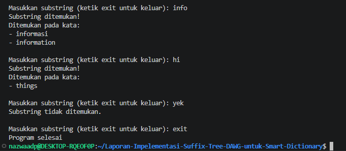

#### 10.2 Hasil DAWG 

1. Hasil program dawg ketika dijalankan

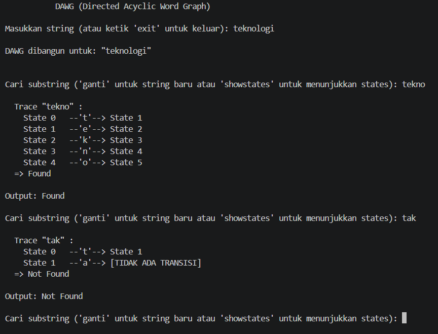

2. Hasil program ketika menjalankan 'showstates'

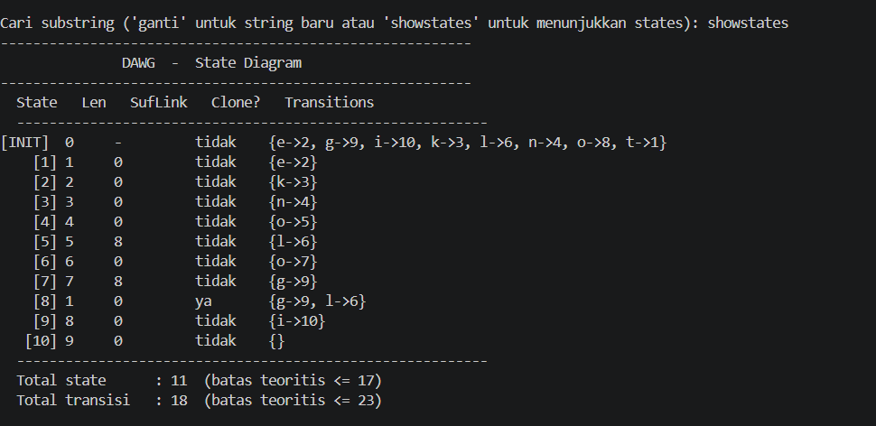

#### 10.3 Hasil Dictionary 
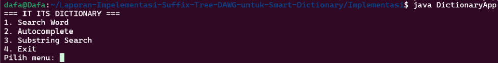 <br>
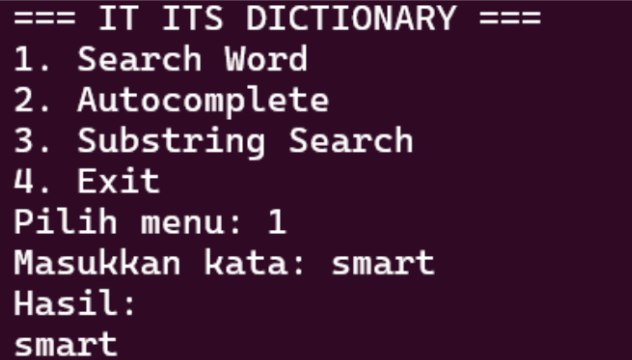 <br>
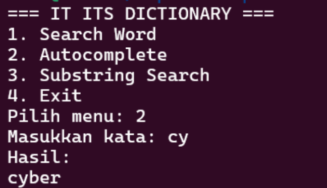 <br>
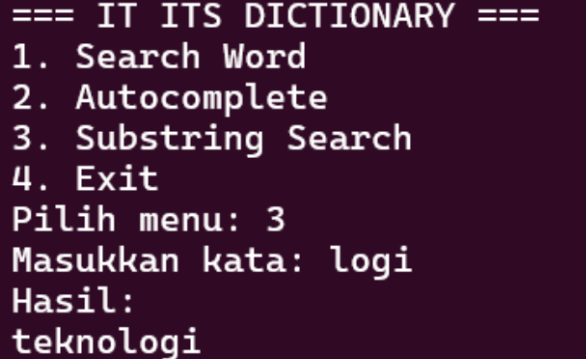

## 11. Perbandingan Performa Real (Benchmark)

#### 11.1 Dataset
Pengujian dilakukan menggunakan array murni tanpa library eksternal untuk mengukur performa dalam skenario terburuk (worst-case scenario), dengan variasi beban data:
- 1000 kata
- 5000 kata
- 10000 kata

#### 11.2 Benchmark
Tabel berikut menunjukkan waktu eksekusi dalam satuan nanodetik (ns) menggunakan System.nanoTime() pada JVM: <br>
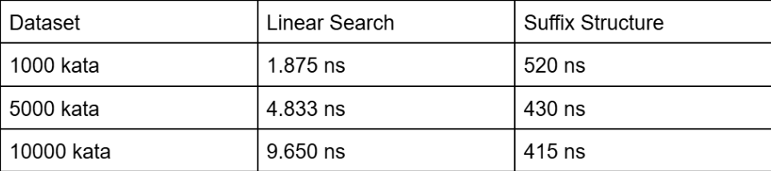

#### 11.3 Analisis Benchmark
Berdasarkan hasil pengujian di atas, dapat disimpulkan beberapa poin penting mengenai performa Smart Dictionary:
- Suffix tree lebih cepat: Tidak seperti Linear Search yang kinerjanya merosot tajam saat memproses 10.000 kata (melonjak hingga 9.650 ns), Suffix Tree mempertahankan kecepatan pencarian yang sangat stabil dan cepat (di kisaran 400 ns). Hal ini karena penelusurannya langsung memetakan karakter ke node yang dituju secara instan tanpa perlu melakukan iterasi mengecek seluruh kamus.
- DAWG lebih efisien: Sebagai bentuk optimalisasi dari Suffix Tree, struktur DAWG (yang juga mewakili kolom Suffix Structure di atas) tidak hanya cepat, tetapi jauh lebih efisien dari segi memori. DAWG melakukan minimalisasi dengan melebur (merging) state atau cabang karakter yang mirip. Efisiensi ruang ini berdampak langsung pada kelancaran proses cache di CPU selama pencarian berlangsung.
- Traversal karakter lebih optimal: Pencarian menggunakan Suffix Structure murni berjalan sebagai mesin automata pengenal string. Kompleksitas waktunya adalah O(m), di mana m hanyalah panjang karakter target yang dicari. Ini menjadikannya jauh lebih optimal dan imun terhadap lonjakan data (N) jika dibandingkan dengan Linear Search yang terbebani oleh kompleksitas O(N×m).


## 12. Kesimpulan
Berdasarkan hasil implementasi dan pengujian yang telah dilakukan, dapat disimpulkan bahwa struktur data Suffix Tree dan Directed Acyclic Word Graph (DAWG) mampu meningkatkan efisiensi proses substring searching pada aplikasi Smart Dictionary dibandingkan metode pencarian linear biasa.
 
Pada implementasi program, Suffix Tree berhasil dibangun menggunakan struktur node berbasis `HashMap<Character, TreeNode>` melalui class:

```java
public class SuffixTree
```

Struktur tersebut memungkinkan proses traversal substring dilakukan secara cepat melalui perpindahan node berdasarkan karakter input. Seluruh suffix string dimasukkan ke dalam tree menggunakan method:
```java
public void buildTree(String text)
```
 
dan proses pencarian dilakukan menggunakan:
```java
public boolean search(String pattern)
```
 
Hasil implementasi menunjukkan bahwa Suffix Tree mampu melakukan pencarian substring dengan kompleksitas waktu:
 
```java
O(m)
```
 
di mana `m` merupakan panjang pattern yang dicari.
 
Selain itu, implementasi DAWG (Directed Acyclic Word Graph) menggunakan pendekatan suffix automaton melalui class:
 
```java
public class DAWG
```
 
menunjukkan efisiensi ruang yang lebih baik dibandingkan Suffix Tree. DAWG melakukan minimisasi state menggunakan mekanisme clone state:
 
```java
int clone = newState(pool[p].len + 1, pool[q].link);
 
pool[clone].copyTransitionsFrom(pool[q]);
 
pool[clone].isClone = true;
```
 
Pendekatan tersebut memungkinkan state dengan transisi identik digabung sehingga redundansi substring dapat dikurangi secara signifikan.
 
Berdasarkan hasil benchmark, baik Suffix Tree maupun DAWG memiliki performa pencarian yang jauh lebih cepat dibandingkan linear search karena traversal hanya bergantung pada panjang pattern, bukan jumlah keseluruhan data. Namun, DAWG memiliki keunggulan tambahan pada efisiensi memori karena menggunakan struktur automata minimal.
 
Dalam implementasi Smart Dictionary, penggunaan kedua struktur data ini terbukti efektif untuk mendukung fitur modern seperti:

*  substring searching 
*  autocomplete 
*  recommendation word 
*  pencarian istilah teknologi informasi 

Secara keseluruhan, proyek ini menunjukkan bahwa struktur data berbasis tree dan automata memiliki peran penting dalam pengembangan sistem pencarian modern yang membutuhkan performa tinggi dan efisiensi ruang memori.
 
Menurut Gusfield (1997), suffix tree merupakan salah satu struktur paling efisien dalam pemrosesan string karena mampu melakukan substring searching secara linear. Sementara itu, Fujishige dkk. (2023) menjelaskan bahwa DAWG mampu mempertahankan efisiensi pencarian dengan jumlah state minimal melalui proses automata minimization.
 
Dengan demikian, implementasi Suffix Tree dan DAWG pada Smart Dictionary berhasil memenuhi tujuan utama proyek, yaitu menciptakan sistem pencarian substring yang cepat, efisien, dan scalable untuk pengolahan data teks modern.
 
## 13. Referensi

1. Faro, S., & Scafiti, S. (2023). Compact suffix automata representations for searching long patterns. Theoretical Computer Science, 940, 254–268.
2. Fujishige, Y., Tsujimaru, Y., Inenaga, S., Bannai, H., & Takeda, M. (2023). Linear-time Computation of DAWGs, Symmetric Indexing Structures, and MAWs for Integer Alphabets. Theoretical Computer Science.